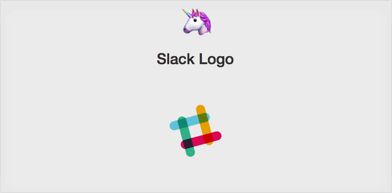

# 🔶 Slack logo
> Animating the slack logo




## Getting Started 🚀

* ``` git clone https://github.com/ragmha/slack-logo.git```

* ```yarn```

* ```yarn start ```

## Reference
[Building-the-slack-animating-logo](http://callmenick.com/post/building-the-slack-animating-logo-with-only-css)

## License
[MIT](./license) © [Raghib Hasan](http://raghibm.com/)
